:stem:
:toc: left
:bibtex-file: references.bib

= Why Number Theorists are Puzzled by Donuts pass:q[ ] The Birch and Swinnerton-Dyer Conjecture  
Michaël Maex

In the year 2000 the _Clay Mathematics Institute_ made a list of seven
of the most important open problems in mathematics, which are known as
the _Millenium Problems_. The Clay Institute will award a million
dollars for a solution to each of these problems. So far only one of the problems
problem, the _Poincaré conjecture_ has been solved. Two of the problems
on the list concern number theory, the _Riemann Hypothesis_ and the
_Birch and Swinnerton-Dyer conjecture_. Both have deep connections to
other parts of number theory and mathematics as a whole. I will explain
my personal favourite of the two, the Birch and Swinnerton-Dyer
conjecture, often abbreviated as BSD. To understand what BSD says and why it’s
important, it’s best to take a walk through history, starting in the
Roman Egypt.

This text is a reworked version of a university assignment that I poured too many hours into.
The research was very interesting and I stumbled across a seemingly forgotten but inspiring story of how Peter Swinnerton-Dyer did the best work of his career because of a unfortunate setback. 
So it would be shame not to share it. 
The intended audience is starting math students and scientists in others fields.
So to get all the mathematical details some previous knowledge is required.
However I do hope that there is enough history throughout the text to keep a general audience interested. 

The main sources of this document are the talk by Manjul Bhargava cite:[manjulbhargavaWhatBirchSwinnertonDyer2016] and the problem description by the Clay Mathematics Institute cite:[wilesBIRCHSWINNERTONDYERCONJECTURE] for the mathematical details, chapter 14 of _Visions of Infinity_ by Ian Steward cite:[stewartVisionsInfinityGreat2014] and the biography of Diophantus cite:[DiophantusBiography] for historical facts. 
When another source is used it, it will be indicated in the text. 

*Warning:* Because of the technical nature of this material I was forced to balance mathematical details and accuracy with clarity. For this text I found clarity to be more important, but to achieve that I had to shove some technical but important details under the rug. So please do not take any of the mathematical statements as fact. However, there are some excellent sources in the bibliography for further reading. 

'''

[[sec:diophantine_equations]]
The beginnings of algebra
-------------------------

Diophantus of Alexandria is a mathematician who lived in Alexandria,
Egypt in the Roman empire, probably around the third century. 
He is famous for his series of books _Arithmetica_ in which he presents and solves many mathematical problems. 
This book is the first known case of symbols being used to represent unknown variables in an equation, similar to modern algebra.  
His work is distinct from the Greek and Babylonian mathematical schools at the time,
because Diophantus dealt neither with geometry nor approximations. 
Because of this, he sometimes is called the father of algebra. 
It is a bit ironic that his work developed later into a branch of geometry, 
called algebraic geometry, which is at the heart of the BSD conjecture.

Arithmetica is somewhat famous among mathematicians because it inspired many problems in number theory. 
Particularly Pierre de Fermat wrote his famous _last theorem_ in the margin of his copy of Arithmetica, next to problem II,8.
A proof of Fermat’s last theorem was discovered more than 350 years later by Andrew Wiles.

In Arithmetica, Diophantus gathered and solved problems like:

[[example-diophantine]]
II,8::
  Write latexmath:[$16$] as the sum of two squares.
  cite:[neffDiophantusArithmetica(5)]
IV,12::
  Find numbers latexmath:[$x$] such that for some latexmath:[$n$] we
  have that latexmath:[$x^3 + n x^2$] is a cube. cite:[sesianoBooksIVVII2012(12)]

In modern language most of Diophantus’ problems can be phrased as the
same type of problem: Can we find two numbers latexmath:[$x, y$] that
satisfy some polynomial relation 
[latexmath]
++++
f(x, y) = 0.
++++
For problem II,8 the polynomail would be latexmath:[f(x, y) = x^2 + y^2 - 16] and for IV,12 we need latexmath:[f(x, y)= x^3 + n x^2 - y^3]. 

Diophantus wanted exact solutions, and he looked for them in the
only kind of numbers known at the time, (positive) integers and rational
numbers.footnote:[This is a lot more difficult than finding real or
complex solutions. E.g. latexmath:[$x^2 =  2y^2 $] has no rational
solutions besides latexmath:[$x = 0, y = 0$] as it may be rewritten as
latexmath:[$(x / y)^2 = 2$] and neither
latexmath:[$\sqrt{2}, -\sqrt{2} $] are rational. On the other hand there
are many real solutions.] Polynomial equations where we look for
rational solutions are nowadays known as _Diophantine equations_.
Diophantus only knew a collection of tricks, each only applicable in
very specific situations. All his solutions were adhoc and a solution to
one problem did not translate to a solution for another. While many
mathematicians kept on developing Diophantus’ methods, general methods
and theorems seemed out of reach. This changed during the 20th century
when mathematicians started to discover the deep connections between
algebra and geometry and developed the theory now known as _Algebraic
Geometry_.

[[sec:polynomials_are_curves]]
Turning algebra into geometry
-----------------------------

To turn the problem into geometry we need to think about latexmath:[$x$]
and latexmath:[$y$] as coordinates in a plane. So we rephrase the
problem: given a polynomial latexmath:[$f$] in two variables with
integer coefficients, is the set of __rational
points__
[latexmath]
++++
\mathcal{C} ({\mathbb{Q}}) = \{(x, y) \in {\mathbb{Q}}^2  \mid f(x, y) = 0\}
++++
non-empty? If so, how big is it? Can we say anything about its shape?

The notation latexmath:[$\mathcal{C} ({\mathbb{Q}})$] suggest that we
may fill in other kinds of numbers. Indeed, we write
latexmath:[$\mathcal{C} ({\mathbb{R}}), \mathcal{C} ({\mathbb{C}})$] for
the sets real and complex points respectively. The letter
latexmath:[$\mathcal{C} $] stands for _curve_, because if we highlight
the real solutions of latexmath:[$f$] in the latexmath:[$xy$]-plane, it
looks like a curve.

[[fig_algebraic_curves]]
.Curves relating to the two diophantine problems <<example-diophantine, above>>
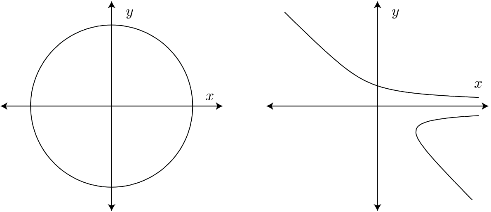

[fig:mordell]
.Louis J. Mordell cite:[LouisMordellBiography]
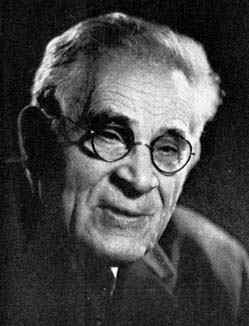

In the beginning of the 20th century Louis J. Mordell worked on
Diophantine equations and he knew of many examples. He noticed an odd
connection. The shape of the complex solutions
latexmath:[$\mathcal{C} ({\mathbb{C}})$] reveals a lot about the number
of rational points latexmath:[$\mathcal{C} ({\mathbb{Q}})$]! In
<<fig_algebraic_curves, the figure above>> we saw that
latexmath:[$\mathcal{C} ({\mathbb{R}})$] looks like a curve. Allowing
complex solutions gives one more degree of freedom, so
latexmath:[$\mathcal{C} ({\mathbb{C}})$] is a surface, just like the real line becomes a plane when looking at complex numbers. 
In fact
latexmath:[$\mathcal{C} ({\mathbb{C}})$] looks like a donut, but with
maybe more holes cut out (see <<fig_genus-of-surface, figure 3>>). 
footnote:[This is not entirely accurate. In fact we need to add a
few missing points to latexmath:[$\mathcal{C} ({\mathbb{C}})$] that in
some sense lay at the edge of latexmath:[${\mathbb{C}}^2$]. This is
called _completing the curve_. We will see this again when we discuss
elliptic curves.] 
A donut with latexmath:[$0$] holes is a
sphere.
The number of these holes is called the _genus_ of the
curve latexmath:[$\mathcal{C} $] and this is usually denoted by
latexmath:[$g$].

[[fig_genus-of-surface]]
.The genus of a complex curve
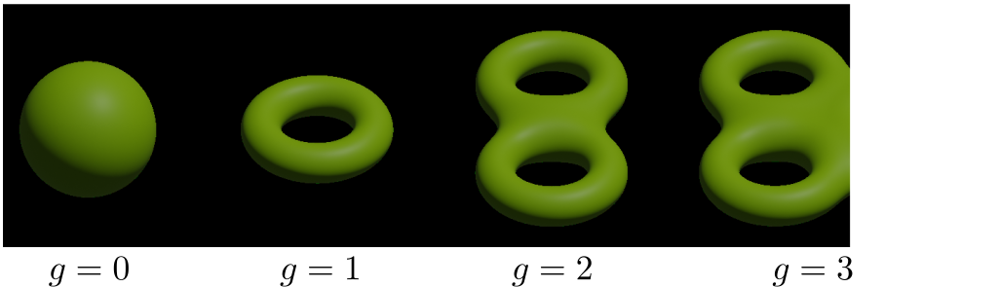

Mordell’s genius idea was to relate this number of holes to the amount
of solutions of a diophantine equation. If latexmath:[$g = 0$] the curve
has either zero of infinite rational points and the case can be
determined by an algorithm. 
[fig:faltings]
.Gerd Faltings cite:[schmidrenateGerdFaltingsOberwolfach2005]
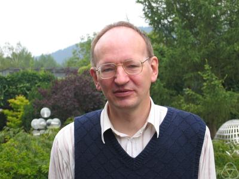
Genus zero curves can always be rewritten to
be given by a quadratic polynomial. Quadratic polynomials in two
variables satisfy the _Hasse Principle_, which roughly states that
latexmath:[$f$] has a rational solution if and only if it has a solution
modulo every power of every prime. There are algorithms to compute
whether this is the case.

If latexmath:[$g \ge 2$] then Mordell noticed that all the curves he
knew of either had no or only finitely many rational points. However he
was not able to prove this himself. It was finally proven in 1983 by
Gerd Faltings, and is since known as _Faltings theorem_.

[[sec:elliptic_curves]]
Elliptic curves
---------------

The Hasse principle and Faltings theorem give answers to the question of
how many rational points there are on curves of genus
latexmath:[$g = 0$] and latexmath:[$g \ge 2$]. That leaves the case of
genus latexmath:[$1$] curves, i.e. curves whose complex points look like
a donut.
They are called _elliptic curves_ and they pop up all over
mathematics, in number theory, physics, cryptography and more.
Contrary to what the name suggests, elliptic curves *do not* look like ellipses!
We usually denote elliptic curves by latexmath:[$\mathcal{E} $] instead of
latexmath:[$\mathcal{C} $]. 
The problem of rational points on these curves is more difficult because they can have
zero, finite or infinite rational points. 
There are still many open questions relating their rational points. 

But Elliptic curves have one big advantage that sets them apart from any
other kind of curve. They are secretly a group, or rather their sets of
points
latexmath:[$\mathcal{E}({\mathbb{Q}}) , \mathcal{E} ({\mathbb{R}})$] and
latexmath:[$\mathcal{E} ({\mathbb{C}})$] are groups. 
This means that there is a good notion of adding two real/complex/rational points to get a third point. 
So besides tools from algebraic geometry, we also have tools from group theory at our disposal to study the rational points. 

It is a non-obvious fact that any elliptic curve can be written
as 
[latexmath]
++++
f(x,y) = y^2 - (x^3 + ax + b) = 0
++++
for some fixed
numbers latexmath:[$a, b$] with latexmath:[$4a^3 + 27b^2 \ne 0$]. The
real points of an elliptic curve look something like this: 

.The Elliptic Curve latexmath:[$y^2 = x^3 - x + 1$]
[fig:elliptic-curve]
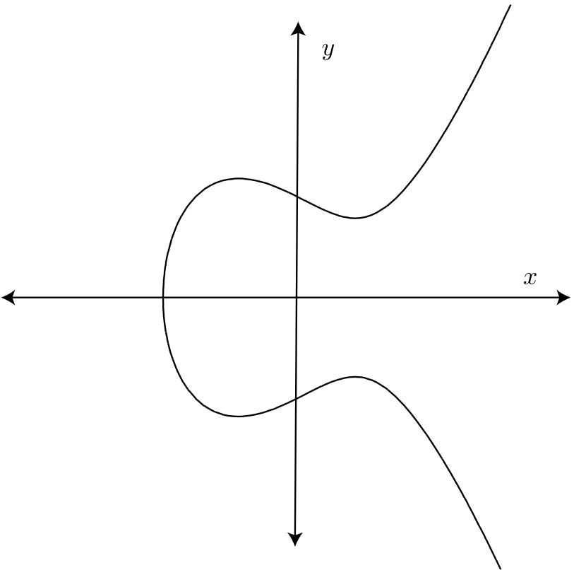

This actually does not give the full picture. We need to _complete the
curve_, i.e. add an extra point. As you can see the curve asymptotically
goes up and down. You can imagine these two ends meeting up again at
some point infinitely far up, or down. We will call this point
latexmath:[$O$].

.Addition on an elliptic curve
****
Let latexmath:[$A, B$] be the points on
latexmath:[$\mathcal{E} $] we would like to add.
Then the sum latexmath:[$A + B$] can be obtained via the following procedure:

.  Draw the line latexmath:[$\ell$] connecting latexmath:[$A, B$].
.  Because, the curve is cubic, latexmath:[$\ell$] intersects
latexmath:[$\mathcal{E} $] in a third point, latexmath:[$C$].
.  Mirror latexmath:[$C$] across the latexmath:[$x$]-axis to obtain
latexmath:[$A + B = C'$].

[fig:addition-on-elliptic-curve]
.Addition on an elliptic curve
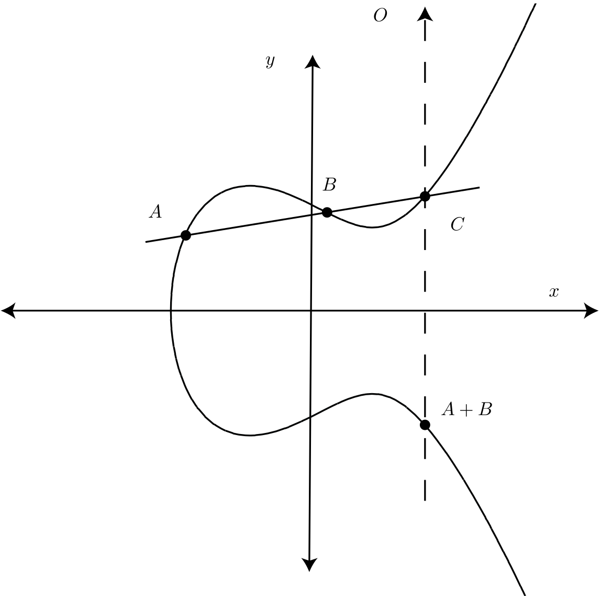

We will write latexmath:[$A'$] for the mirror image of latexmath:[$A$] along the latexmath:[$x$]-axis 

If latexmath:[$A, B$], are mirror images, i.e.  latexmath:[$B = A'$], then  
latexmath:[$\ell$] goes straight up, and we say the third point of
intersection is latexmath:[$O$].

The point latexmath:[$O$] is special. The line through latexmath:[$A$]
and latexmath:[$O$] intersects latexmath:[$\mathcal{E} $] in the mirror
image  latexmath:[$A'$]. If we mirror back we get latexmath:[$A'' = A$]
again. So latexmath:[$A + O = A$] and latexmath:[$O$] acts a zero. This
addition is commutative and associative and has identity
latexmath:[$O$].

In the picture we have implicitly assumed that the points are real
points. But the same construction works equally well for
latexmath:[$\mathcal{E} ({\mathbb{C}})$] and
latexmath:[$\mathcal{E} ({\mathbb{Q}})$].
****

[[sec:studying_groups]]
Understanding the group structure
---------------------------------

While Mordell was unable to completely describe the group structure of
latexmath:[$\mathcal{E} ({\mathbb{Q}})$] he did prove that
latexmath:[$\mathcal{E} ({\mathbb{Q}})$] is a finitely generated group.
That means that there are a finite number of points
latexmath:[$P_1, \ldots, P_n$] such that every other rational point can
be obtained by adding and subtracting these points.

There are two types of points in
latexmath:[$\mathcal{E} ({\mathbb{Q}})$]. There are points where
repeatedly adding the same point to itself eventually yields the
identity latexmath:[$O$]. These points are called _torsion points_. A
fun exercise is to check that any two torsion points add to another
torsion point.

On the other hand there are points where repeated addition will keep
generating new points. In particular, if such a point exists then
latexmath:[$\mathcal{E} ({\mathbb{Q}})$] has infinitely many points.

So the group latexmath:[$\mathcal{E} ({\mathbb{Q}})$] falls apart into
two parts, the _torsion part_ and the _free part_
[latexmath]
++++
\mathcal{E} ({\mathbb{Q}}) = \mathcal{E} ({\mathbb{Q}})_\text{tors} \oplus \mathcal{E} ( {\mathbb{Q}})_\text{free}  
++++
Mordell’s theorem implies that the torsion part is finite and that
the free part is isomorphic to latexmath:[${\mathbb{Z}}^{r}$], the
tuples of latexmath:[$r$] integers, for some latexmath:[$r$]. Nowadays
the torsion part is well understood, but the free part has proven to be
more difficult to grasp.

The value latexmath:[$r$] is a way to measure how big the group
latexmath:[$\mathcal{E} ({\mathbb{Q}})$] is. If latexmath:[$r= 0$], then
latexmath:[$\mathcal{E} ({\mathbb{Q}})$] only has torsion points, and
thus is finite. On the other hand if latexmath:[$r \ge 1$], then there
is a point that can be repeatedly added to itself to generate an
infinite amount of points. This number latexmath:[$r$] associated to
latexmath:[$\mathcal{E}$] is called the _rank_ of
latexmath:[$\mathcal{E} $] and mathematicians would love to understand
the rank better.

The Birch and Swinnerton-Dyer conjecture is so important because it relates the rank to other properties of the curve!

[[sec:the_edsac_computer]]
Computers
---------

Peter Swinnerton-Dyer was a research fellow in mathematics at Trinity
College in Cambridge. Unfortunately he was rejected twice for a
assistant-lectureship at the maths department. So he took a job at the
Cambridge computer lab where he spend ten years. Here he had access to
the labs’ fancy new toy, the EDSAC II computer. 

Had he not been rejected and forced to take the position in the computer lab, he would have never been able to come up with the conjecture cite:[swinnertondyerInterviewSirPeter2008].
When life gives lemmons, ... 
Nevertheless he kept his research position for mathematics at Trinity College.

[quote, Peter Swinnerton-Dyer, Interview in Cambridge]
Had I not been there I don't think the Birch Swinnerton-Dyer conjectures would ever have happened because they couldn't have been made credible without the use of a computer.

At Trinity he met Bryan Birch, another mathematics research fellow. They
teamed up to use the EDSAC II computer to compute a lot of explicit
examples on elliptic curves. Doing a lot of computations and looking for
patterns is certainly not a new idea in mathematics, especially number
theory.footnote:[My personal favourite theorem, _quadratic reciprocity_,
was discovered because early number theorists like Guaß computed a lot
of examples by hand.] But the use of a computer for this was new at the
time. Birch’s supervisor, J. W. S. Cassels was very sceptical about
their approach at first.

.Peter Swinnerton-Dyer (left) and Bryan Birch (right) cite:[BirchSwinnertonDyerConjecture]
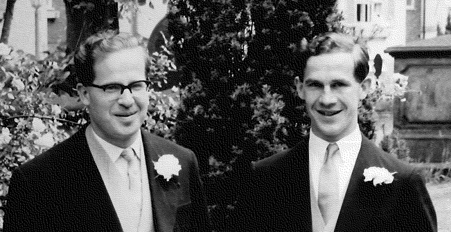

.The EDSAC I and II Computers
****
EDSAC is an acronym for _Electronic Delayed
Storage Automatic Calculator_. The name refers to the computer’s unique
memory system, which uses sound waves to delay information so it could
be captured on the next cycle. It was constructed at Cambridge
University and ran its first successful programme in 1949. It is
considered the first practical computer that stored its programme in
memory, instead of needing to be physically rewired.

.Replica of the original EDSAC cite:[geniEnglishPhotoEDSAC2018]

In 1958 it was replaced by EDSAC II. While it shares the name with its
predecessor, it used much faster magnetic memory and was the first
computer to be microprogrammable. It also had a much improved arithmetic
unit.
If you're interested to learn more about the technical aspects of the 
EDSAC II you can find more information in cite:[wilkesEDSAC1992a]
****

What did Birch and Swinnerton-Dyer exactly compute? So far we have been
plugging in real, complex and rational numbers into the equation for
elliptic curves. But one can also fill in numbers from
latexmath:[${\mathbb{F}}_p$], the integers modulo some prime number
latexmath:[$p$]. Correspondingly we can look at
latexmath:[$\mathcal{E} ({\mathbb{F}}_p)$] the set of all solutions to
the equation latexmath:[$y^2 = x^3 + ax + b$] modulo latexmath:[$p$].
This set and its size is easy to compute. A quick and dirty, but
effective way is to simply try each of the latexmath:[$p^2$]
possibilities for latexmath:[$(x, y)$]. Birch and Swinnerton-Dyer used a
more efficient method.

.The latexmath:[${\mathbb{F}}_{11}$] points of latexmath:[$y^2 = x^3 - 4x + 1$]
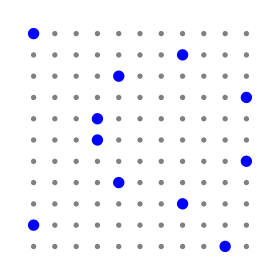

It is no coincidence that in the curve above there are latexmath:[$11$]
points modulo latexmath:[$11$]. For a given prime latexmath:[$p$] we
actually expect there to be approximately latexmath:[$p$] points in
latexmath:[$\mathcal{E} ({\mathbb{F}}_p)$], but not exactly. Let
latexmath:[$N_p$] be the number of points in
latexmath:[$\mathcal{E} ({\mathbb{F}}_p)$]. Inspired by the Hasse
principle and earlier work by Siegel for quadratic equations, they hoped
that the values latexmath:[$N_p$] would reveal something about the
rational points on latexmath:[$\mathcal{E}$].

Like Siegel, they took all primes below some number latexmath:[$x$] 
and they looked at the function cite:[swinnerton-dyerNotesEllipticCurves(11)]
[latexmath]
++++
f(x) = \prod_{p \text{ prime} < x} \frac{N_p}{p}.
++++
Plotting latexmath:[$f(x)$] with a logarithmically scaled
latexmath:[$x$]-axis revealed a remarkable pattern. For curves of rank
latexmath:[$0$] they found that latexmath:[$f(x)$] stayed roughly
constant. For a rank latexmath:[$1$] curve it was a straight but
increasing line and for a rank latexmath:[$2$] curve the graph
approximates a parabola!

[fig:]

[.float-group]
--
.The data for a rank 0 curve 
[.left]
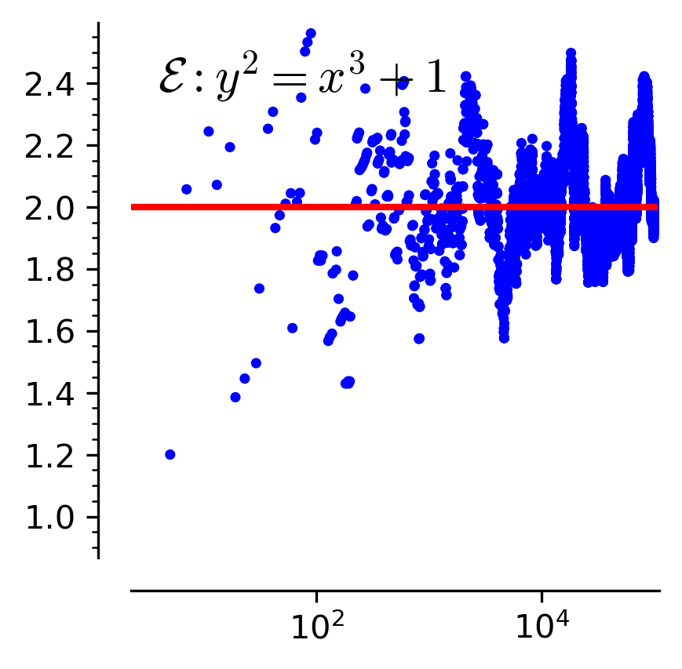

[.left]
.The data for a rank 1 curve 
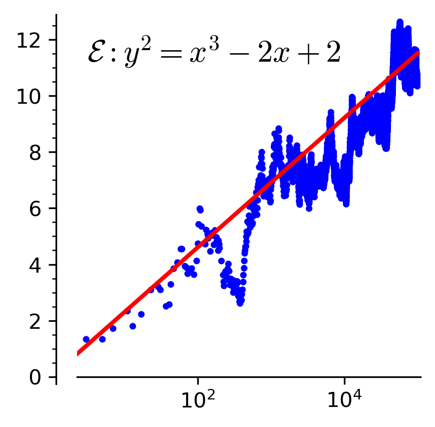

.The data for a rank 2 curve 
[.left]
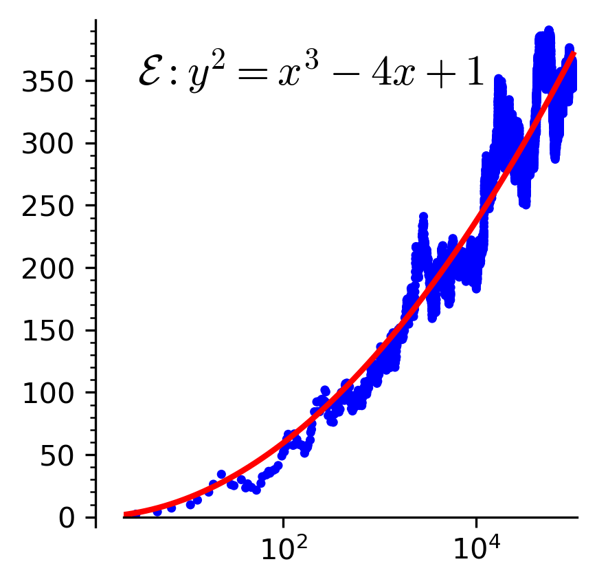
--

Their data suggests the following approximation
[latexmath]
++++
f(x) = \prod _{p \text{ prime} < x} \frac{N_p}{p} \sim C\cdot \log(x)^{r}
++++
where latexmath:[$r$] is the rank of latexmath:[$\mathcal{E} $] and
latexmath:[$C$] is some constant depending on
latexmath:[$\mathcal{E} $]. So the rank is hidden in the numbers
latexmath:[$N_p$]! This is the BSD conjecture, or rather this is one
way to state the conjecture.

[[sec:links_with_analysis]]
Links with analysis
-------------------

Birch and Swinnerton-Dyer went one step further and linked their
conclusion to complex analysis, in particular the
latexmath:[$L$]-function of an elliptic curve. latexmath:[$L$]-functions
are cousins of the famous Riemann-Zeta function, but instead of encoding
information on prime numbers, the latexmath:[$L$]-function of an
elliptic curve encodes information about the numbers latexmath:[$N_p$].
For elliptic curves the latexmath:[$L$]-function can be defined as
[latexmath]
++++
L_{\mathcal{E} }(s) = \prod_{p \text{ prime}}\frac{1}{1 + (N_p - p -1)p^{-s} + p ^{1 - 2s}}.
++++
They conjectured that latexmath:[$L_\mathcal{E} $] has a zero of
order latexmath:[$r$] at latexmath:[$s = 1$]. This roughly means that
close to latexmath:[$s = 1$] the following approximation holds
[latexmath]
++++
L_{\mathcal{E} }(s) \sim (s - 1)^{r}\cdot c
++++
for some constant latexmath:[$c$].
This is the modern phrasing of the conjecture.

This was a bold conjecture, because at the time it was not even known
whether latexmath:[$L$]-functions are well defined for elliptic curves!

[[sec:conclusion]]
The current state
-----------------

A lot of progress has already been made, yet a lot remains to be done.
We know that latexmath:[$L$]-functions for elliptic curves are well
defined. It is also known that if latexmath:[$L_{\mathcal{E} }$] has a
zero of order latexmath:[$0$] or latexmath:[$1$] at latexmath:[$s = 1$]
that the rank of latexmath:[$\mathcal{E} $] is latexmath:[$0$] or
latexmath:[$1$] respectively. The converse is also true under some
extra, but mild assumptions.

However the techniques used to solve the rank latexmath:[$0$] and
latexmath:[$1$] cases do not generalize to elliptic curves of higher
rank. For these curves we still know very little. Probably new ideas are
necessary to work on curves of rank latexmath:[$2$] and higher.

The BSD conjecture has also led to various generalisations and related
conjectures, which would answer many questions about rational points
beyond curves, like surfaces. So techniques that tackle the BSD
conjecture would likely be useful in a much broader context.

It seems like BSD will remain open for a while. But who knows, maybe one
day you will find the missing pieces and walk home with a million
dollars.

[[sec:references]]
Bibliography
------------

bibliography::[]

